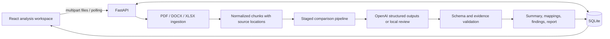

# AlemScope · Organizational change intelligence

AlemScope is a HackAlem AI prototype for comparing organizational structures and responsibilities before and after a restructuring. It turns document sets into a reviewable analysis: organizational changes, function mappings, potential gaps, duplication, overlaps, conflicts, and an analytical report with source excerpts.

The product is a corporate analysis workspace, not a chatbot. Its central rule is **evidence before conclusions**. All findings are recommendations requiring a responsible employee's review. An absent mention is never sufficient proof that a function ceased to exist.

## What works

- Multiple BEFORE and AFTER uploads in DOCX, text-based PDF, and XLSX format.
- Persistent analyses in a local SQLite database, recent analyses, and live backend stages.
- Organizational unit and function extraction, comparisons, risk review, confidence labels, and uncertainty notices.
- Source evidence on unit mappings, function mappings, and findings: filename, side, exact normalized excerpt, and page/clause, paragraph, or sheet/row when available.
- Executive summary, separate finding categories, and a readable report with copy and Markdown download.
- Two explicitly different execution modes: **Local review** for a reproducible demonstration without an API key; **OpenAI analysis** for staged semantic reasoning.
- An optional one-click demonstration using the two supplied anonymized audit regulations.

## Modes and honest expectations

**OpenAI analysis** uses the OpenAI Responses API with Pydantic structured outputs for separate reasoning steps. Configure `OPENAI_API_KEY` on the server. The application does not put the key in the browser, does not silently switch to local review on provider failure, and does not embed a key in the repository. Uploaded text is sent to OpenAI only when OpenAI mode is selected. API use may incur charges on your account.

**Local review** runs entirely in Python without a model call. It detects organizational names and function candidates with deterministic text patterns and compares lexical similarity. It is deliberately labeled a limited review, not semantic AI. It is useful for exercising ingestion, persistence, comparisons, evidence, and the full interface when credentials are unavailable. Treat its possible losses and overlaps as review candidates. Similar wording alone cannot establish identical accountability, a genuine duplication, or a conflict of interest.

Confidence values are heuristic/model estimates, not calibrated probabilities. Extracted unit counts describe the submitted documents and may include mentioned organizational bodies; they are not a verified count of all company departments.

## Architecture



Frontend: React, TypeScript, Vite, Lucide icons, custom responsive CSS. Backend: Python, FastAPI, Pydantic. Storage: SQLite. Parsers: `python-docx`, `pypdf`, `openpyxl`. AI: the official OpenAI Python SDK. One backend process owns the analysis pipeline; there is no queue service, vector database, or microservice deployment.

See [docs/ARCHITECTURE.md](docs/ARCHITECTURE.md) for the model, validation boundaries, and engineering decisions.

## Prerequisites

- Python 3.11 or newer.
- Node.js 20 or newer and npm.
- A modern browser.
- Network access for the initial dependency install; an OpenAI API key and network access for OpenAI mode.

Commands below run from the repository root unless a `cd` is shown. macOS/Linux examples use `.venv/bin`; on Windows activate `.venv\Scripts\Activate.ps1` instead of `.venv/bin/activate`.

## Install

```bash
python3 -m venv .venv
source .venv/bin/activate
python -m pip install -r backend/requirements.lock.txt
cp .env.example .env
cd frontend
npm ci
cd ..
```

Edit `.env` if you want OpenAI analysis. An empty key is valid for Local review.

```dotenv
OPENAI_API_KEY=
OPENAI_MODEL=gpt-4.1-mini
DATABASE_PATH=./data/alemscope.sqlite3
```

- `OPENAI_API_KEY`: server-only key; required only for OpenAI mode.
- `OPENAI_MODEL`: model used for structured Responses API calls. The default is configurable; your account must have access to the selected model and structured outputs.
- `DATABASE_PATH`: SQLite database path. The built-in default is `data/alemscope.sqlite3` under the repository root; a relative override is resolved from the process working directory. Run the backend from the repository root.

Upload limits are fixed in this prototype: 20 MiB per file, 60 MiB total, and 10 files in each group.

`.env`, local data, virtual environments, build output, and dependency directories are Git-ignored. Do not prefix a secret with `VITE_`; Vite variables can become public browser assets.

## Run

Terminal 1, repository root:

```bash
source .venv/bin/activate
python -m uvicorn app.main:app --app-dir backend --host 127.0.0.1 --port 8000
```

Terminal 2:

```bash
cd frontend
npm run dev
```

Open [http://127.0.0.1:5173](http://127.0.0.1:5173). Vite forwards `/api` to the backend on port 8000. Backend API documentation is at [http://127.0.0.1:8000/docs](http://127.0.0.1:8000/docs); health is at [http://127.0.0.1:8000/api/health](http://127.0.0.1:8000/api/health).

Use a single backend worker for the demonstration. Avoid `--reload` during an analysis because the background job is tied to the process.

## Demo flow

1. Open the dashboard and start a new analysis, or use the supplied demo action.
2. Choose Local review for a demo without external credentials, or OpenAI analysis after configuring a key.
3. Upload one or more documents into each of BEFORE and AFTER. Verify filenames, remove mistakes, and run the analysis.
4. Watch the real backend stages. Parsing happens before the analysis is queued; subsequent stages are persisted as the worker progresses.
5. Review summary counts, then organizational mappings and function mappings. A status alone is not the evidence: open the source excerpts.
6. Inspect the findings by category and compare the BEFORE and AFTER evidence. A possible missing function may have no matching AFTER excerpt; this absence is explicitly a limitation to investigate.
7. Review the final report, copy it, or download Markdown. Return to the dashboard and reopen the persisted analysis.

The supplied demo assigns edition 8 to BEFORE and edition 9 to AFTER based on the edition labels. It reprocesses those real PDFs; it does not load fabricated results. See [fixtures/README.md](fixtures/README.md) and `fixtures/manifest.json` for provenance and inspection notes. The HackAlem brief is product context, not an uploaded organizational source.

If fixture files are missing:

```bash
python scripts/import_fixtures.py --source-dir /path/to/provided/files
```

Without `--source-dir`, the importer looks in your Downloads folder. The two original anonymized PDF filenames must match those recorded in `fixtures/README.md`. Custom uploads work independently of the fixture demo.

## AI pipeline and explainability

1. Parse each document deterministically and preserve its source metadata.
2. Extract organizational units from chunk batches with cited evidence.
3. Extract verbatim functions, attach them to known units, and independently verify ownership; uncertain assignments are omitted with coverage warnings.
4. Match units, allowing unchanged, renamed, reorganized, created, removed, and uncertain outcomes.
5. Match functions independently of clause numbers.
6. Detect potential losses, duplication, overlaps, and conflicts with explicit explanations.
7. Validate identifiers, entity references, source existence, exact quotes, and required BEFORE/AFTER sides; independently review all substantive mappings (including unchanged functions) and findings for evidentiary support.
8. Calculate metrics and assemble the readable report from accepted records.

Pydantic rejects malformed responses and unknown fields. Quotes must be exact substrings of normalized source chunks. The application resolves filenames and locations from trusted ingestion records; it does not trust model-authored citation metadata. Unsupported evidence is rejected or retained only as an uncertainty/warning according to the validation stage. A second model review can assess whether genuine quotes support the proposed finding, but remains fallible. Human review is required even when the technical citation check passes.

Document content is untrusted data. The AI system prompt explicitly rejects instructions embedded in uploaded files. No macros are executed, no document links are followed, and file content is not evaluated as code. A valid quote demonstrates traceability, not logical proof of the conclusion.

## Testing and quality checks

```bash
source .venv/bin/activate
python -m pytest backend/tests -q
python -m ruff check backend
cd frontend
npm run typecheck
npm run build
```

Tests cover upload validation, DOCX/PDF/XLSX normalization, schema rejection, exact evidence checks, pipeline behavior, and API health/upload/analysis/report flows. Model behavior is mocked in automated tests; a passing test suite is not a claim that the configured model was called live. The production frontend build also runs TypeScript checking. The delivered build passed 40 Python tests, Ruff, TypeScript, a production Vite build, and browser checks of the dashboard, real fixture demo, mapping filters, source details, report copying, and a 390-pixel mobile viewport. No live OpenAI call was verified because no API key was configured. Browser validation should exercise the complete upload-to-report flow, including evidence and error states.

## Project structure

```text
backend/
  app/
    main.py          HTTP API, upload flow, background analysis
    ingestion.py     Format validation and source-aware parsers
    models.py        Pydantic entities and response contracts
    ai.py            Structured OpenAI calls and model schemas
    pipeline.py      Extraction, matching, review, reporting
    local.py         Explicitly limited lexical review mode
    evidence.py      Citation validation and source locations
    database.py      SQLite persistence
  tests/             Critical automated tests
  requirements.txt
frontend/
  src/               React screens, typed API client, styles
  package.json
fixtures/             Optional supplied PDFs and provenance manifest
scripts/
  import_fixtures.py  Reproducible fixture setup
docs/
  ARCHITECTURE.md
.env.example
```

`work/` holds ignored development scratch files; `data/` holds ignored runtime data. The repository does not require those scratch files to run.

## Security and deployment scope

This prototype is designed for a single analyst on localhost. Authentication is intentionally deferred to keep the core comparison workflow complete. Analysis records do not have tenant/user ownership boundaries yet. Do not expose this instance directly as a shared public service. There is no claim of production isolation, encryption at rest, or regulatory compliance.

The backend validates upload extensions, file contents, sizes, and document structure; filenames are sanitized. Local SQLite stores extracted document content and results. The OpenAI key remains in the backend environment. Provider failures produce a failed analysis instead of invented results or a silent fallback.

## Known limitations

- No OCR: image-only/scanned PDFs cannot be analyzed as text. Convert them to searchable documents first.
- Complex PDF layouts, floating Word objects, diagrams, and spreadsheet charts may lose information during text extraction. Spreadsheet formulas are retained as expressions, not evaluated. PDF paragraph boundaries are inferred; page locations are authoritative for the extracted text.
- Local review uses lexical heuristics and has lower recall/precision than semantic analysis. It cannot reliably identify renaming, reorganizations, or contextual conflicts, and does not generate conflict assessments. Russian name inflections and implicit ownership can reduce extraction accuracy.
- Neither mode can prove the absence of an organizational function outside the submitted set. Multiple clauses can express the same duty, and shared wording can describe legitimate coordination.
- OpenAI mode depends on model access, availability, rate limits, context/output limits, and API cost. Large or highly repetitive document sets may require smaller analyses. Pipeline limits include 600,000 extracted characters total, 150 units, and 600 responsibilities; oversized analyses fail explicitly rather than silently omitting records.
- Background analysis runs in the FastAPI process, not a durable job queue. Keep the backend running until completion; rerun an interrupted analysis.
- Human validation remains necessary. Confidence is not a probability of correctness. Export is Markdown, not formatted DOCX/PDF.
- No authentication, role-based access, multi-tenant isolation, review sign-off, OCR, or external regulatory benchmarking is included.

## Highest-impact next improvements

1. Evaluate extraction and semantic matching against an expert-labeled corpus, including renamed units, reassigned functions, and legitimate shared responsibilities.
2. Add analyst accept/reject decisions, comments, and signed review history to preserve the distinction between machine recommendation and human conclusion.
3. Improve layout-aware ingestion and OCR, and attach evidence to highlighted regions of the original document.
4. Add durable jobs, bounded concurrency, resumability, authentication, and tenant-scoped storage before a shared deployment.
5. Add model/cost telemetry, comparative evaluations, and a stronger semantic entailment check with clear evidence coverage reporting.

The OpenAI adapter follows the official [Structured Outputs documentation](https://developers.openai.com/api/docs/guides/structured-outputs).
