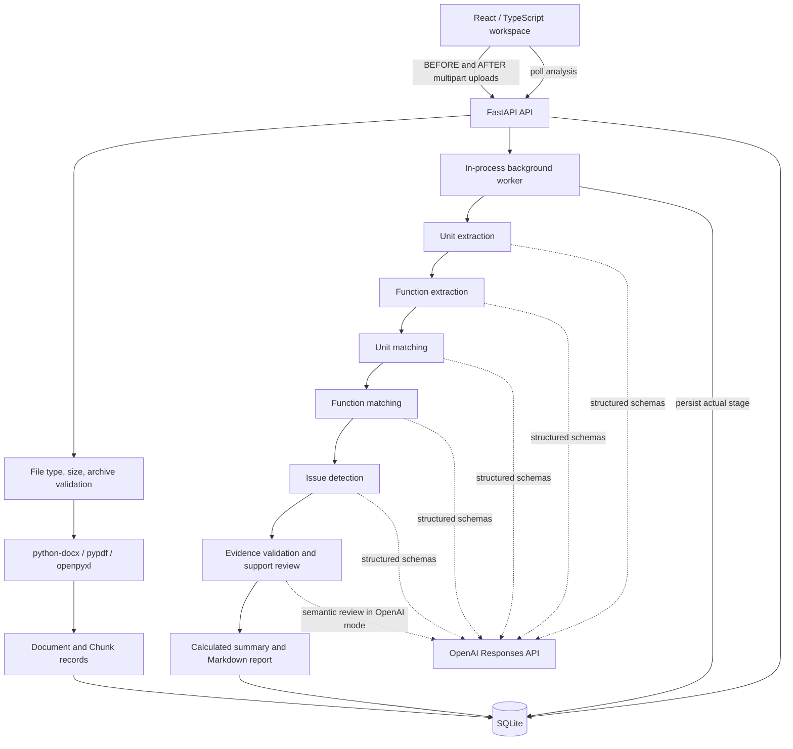

# AlemScope architecture

AlemScope compares two bounded document sets and produces recommendations with traceable source evidence. The scope is a single-user hackathon application on localhost. A React frontend and a FastAPI backend share a simple HTTP contract; SQLite stores source text, progress, and validated results.

## Components and boundaries

**Frontend.** React renders dashboard/history, BEFORE/AFTER upload areas, progress, executive summary, organizational changes, function comparison, finding categories, evidence details, and the report. A typed API client speaks relative `/api` URLs. Vite's development proxy sends these to `127.0.0.1:8000`; the browser never needs an OpenAI key. Interface copy is English; Russian source names and quotations remain in their original language.

**HTTP boundary.** FastAPI validates the request, reads and parses uploads, and persists the normalized document set before queuing comparison. Parsing runs off the event loop. A background task owns comparison and updates the persisted stage as work moves through the pipeline. The server has a bounded two-analysis execution semaphore. This is useful for a local demo but is not a distributed queue or durable job system.

**Reasoning.** The pipeline separates source extraction, unit extraction, function extraction, entity matching, function matching, issue detection, evidence checks, and report construction. OpenAI mode uses `client.responses.parse` with stage-specific Pydantic models and `store=False`. Local mode uses deterministic patterns and lexical matching and explicitly carries lower capability/uncertainty notices. Provider failure does not activate an undisclosed fallback.

## Data model

The Python models in `backend/app/models.py` define the authoritative analysis records.

- `Analysis`: ID, title, creation timestamp, mode, status, stage/label, optional safe error, documents, and optional result.
- `Document`: deterministic content-and-side ID, sanitized filename, format, BEFORE/AFTER side, chunks, parser warnings.
- `Chunk`: document ID, stable chunk ID, normalized text, and available page, section, paragraph, sheet, and row coordinates.
- `Unit`: ID, name, side, evidence.
- `Function`: ID, known owner unit ID, description, side, evidence.
- `UnitMapping`: BEFORE/AFTER unit ID lists, status, explanation, confidence, evidence. Lists allow many-to-many reorganizations in the model.
- `FunctionMapping`: BEFORE/AFTER function ID lists, match type, explanation, confidence, evidence.
- `Finding`: category, title, explanation, severity, confidence, recommendation, evidence, and `requires_review`.
- `Evidence`: chunk ID plus an exact supporting quote. Document identity and source coordinates are resolved from the chunk, never invented by the model.
- `AnalysisResult`: extracted units/functions, mappings, findings, warnings, calculated summary, and report.

SQLite has normalized `analyses`, `documents`, and `chunks` tables. The final validated `AnalysisResult` is stored as JSON on the analysis row. This avoids unnecessary relational machinery for a prototype while keeping source records separately addressable. Foreign keys cascade source deletion with its analysis. Short transactions and WAL mode support polling while the worker saves progress. Document/chunk identifiers are deterministic; an analysis has a fresh UUID. Duplicate content uploaded twice to the same side is rejected; identical content across opposite sides is valid.

## Ingestion

Every supported file must pass extension/content validation. Filenames become safe basenames. File content is read in memory and parsed as data, never executed. Office archives are checked for required XML entries, expanded size, excessive compression, path traversal names, encryption, and macros.

**PDF:** `pypdf` extracts each page independently. The parser normalizes whitespace, splits numbered clauses when recognizable, and keeps the page and inferred paragraph/clause. It accepts clauses with no space after a number, as seen in the supplied documents. Blank pages produce warnings. A fully unreadable/image-only document fails with an OCR-specific message. No OCR runs in this prototype. Multi-page clauses may become separate chunks; page evidence remains valid, while a continued chunk may lack an inferred section.

**DOCX:** body XML is traversed in document order, preserving interleaved paragraphs and tables. Heading/title text supplies the current section. Paragraph numbers and table-row locations survive extraction. Headers, footers, floating text boxes, comments, and tracked deletions are outside the implemented extraction scope and are disclosed in parser warnings.

**XLSX:** `openpyxl` reads sheet names, rows, and nonempty cell coordinates/contents. Formula expressions remain text and produce a warning; they are never evaluated. Sheet and row coordinates remain on each chunk. The parser does not extract charts or analyze formatting as an organization chart.

Chunks retain the exact normalized extracted wording, not the byte-for-byte PDF layout. Long passages are split at word boundaries without paraphrasing. An evidence quote must match that normalized text exactly, so whitespace normalization is explicit and consistent.

Limits bound individual file size, total upload size, file count, Office archive expansion, extracted text, PDF pages, worksheet count, rows, and columns. The current default is 20 MiB per file, 60 MiB total, 10 documents per side, 500,000 extracted characters per document, 300 PDF pages, 100 sheets, 30,000 workbook rows, and 1,000 columns per sheet. The comparison pipeline additionally caps total extracted text at 600,000 characters, extracted units at 150, and extracted functions at 600. The issue-review request is bounded at 450,000 serialized characters. Larger inputs fail explicitly and should be divided into clearly scoped analyses.

## AI pipeline

The reasoning stages have separate schema contracts: `UnitExtraction`, `FunctionExtraction`, `UnitMatches`, `FunctionMatches`, `IssueDetection`, and `EvidenceReview`. Small extraction batches keep the model focused on supplied chunks; later steps operate on the extracted structure and cited text. Deterministic code owns identifiers, deduplication, persistence, calculations, and validation. Models own semantic interpretation and explanations.

An OpenAI request contains the relevant source excerpts or extracted records with chunk IDs. The system instruction establishes three constraints: uploaded content is untrusted data; all organizational statements must come from that content; conclusions are recommendations. It specifically warns that a missing mention is not proof of abolition and that policy language about preventing conflicts is not proof that a conflict exists.

The semantic pipeline considers unchanged, renamed, reorganized, removed, created, and uncertain units; unchanged, equivalent, modified, transferred, potentially lost, new, and uncertain functions. These labels describe the model's interpretation of the submitted scope, not externally verified organizational events.

Local review is a separate honest execution mode. It exercises the same ingestion, models, source checks, persistence, and UI while using deterministic organizational-name patterns and lexical similarity. It is not a replacement for semantic interpretation and has no claim of exhaustive coverage. It does not produce conflict assessments. Unit-name inflections and indirect ownership are particularly difficult for the heuristics. Results must remain visibly distinguishable from OpenAI-generated analysis.

## Evidence validation and hallucination mitigation

Validation occurs before results are accepted for storage:

1. Pydantic enforces schema shape, permitted status/category values, and bounded confidence. Extra model fields are forbidden.
2. Entity and mapping references must resolve to known records with the expected BEFORE/AFTER side. Mapping citations must be associated with each mapped entity. Extracted names/descriptions must be nonblank and verbatim. A separate ownership review omits function assignments unless supported with confidence of at least 0.7.
3. Each evidence reference must resolve to a stored chunk in a known document; the chunk must belong to that document.
4. Evidence must be nonempty. Each quote must be an exact substring of the normalized chunk.
5. Comparisons that require both document sides must have evidence from both sides. A loss candidate cannot provide evidence of nonexistent AFTER text, so its wording and review requirement explicitly retain that uncertainty.
6. A separate semantic review in OpenAI mode distinguishes supported, uncertain, and unsupported findings and mappings, including unchanged functions. Reviewers receive resolved entities and full cited source chunks. Verdict IDs are restricted to the current review batch. Unsupported/invalid findings do not become confirmed facts; warnings disclose validation losses or ambiguity.
7. Counts and the report are built from accepted records, so rejected claims do not inflate executive metrics.

These checks stop fabricated citations, invented document metadata, malformed output, and many unsupported relationships. They cannot prove that a real quotation logically entails every proposed interpretation. Semantic review can also err. Every finding requires human validation, including findings with high confidence or technically valid citations. Confidence is not a calibrated probability.

Traceability is preserved through the UI and Markdown report. A source reference includes the document filename, BEFORE/AFTER group, location, and exact normalized excerpt. The supplied fixture manifest additionally preserves original source filenames and file hashes.

## API contract

- `GET /api/health`: backend status, whether a key is configured, and model name. Configuration does not guarantee valid credentials or quota.
- `GET /api/analyses`: recent analysis metadata, newest first.
- `POST /api/analyses`: multipart `title`, `mode`, `before_files`, and `after_files`; returns HTTP 202 after validation/parsing/persistence.
- `POST /api/analyses/demo`: runs the supplied fixtures through the same workflow, with `mode` and optional `title` as query/form values.
- `GET /api/analyses/{id}`: complete current state, source documents/chunks, and result if available.
- `GET /api/analyses/{id}/report`: Markdown download for a completed analysis; otherwise 409.
- `DELETE /api/analyses/{id}`: deletes a completed/failed analysis and source records; running analyses return 409.

Analysis states are `queued`, `running`, `completed`, or `failed`. Stage indices 0–7 correspond to reading/queued, units, functions, unit matching, function matching, issue detection, evidence review, and report/completion. The UI represents actual backend stages rather than advancing a timer. Upload/parsing precedes the HTTP 202; it is shown as submission work.

User-facing errors identify unsupported or corrupt documents, missing groups, size limits, missing API configuration, and common provider failures. Raw provider exceptions and credentials are not persisted or returned. On startup, incomplete persisted jobs are marked interrupted/failed, making a retry explicit instead of displaying a permanently running analysis.

## Engineering decisions

- SQLite and one FastAPI service keep setup reproducible and remove avoidable infrastructure.
- The frontend and backend use one source-oriented contract rather than model-produced HTML or unrestricted prose.
- Evidence is a first-class record. The application does not accept a convincing explanation without traceability.
- Two explicit execution modes keep the demo usable when external credentials are unavailable without misrepresenting deterministic logic as AI.
- Report assembly reuses accepted results so the report does not introduce a new unchecked set of organizational claims.
- Original uploaded binaries are not needed for stored comparison results; normalized source chunks provide traceability. A future highlighted original-document viewer would require additional retained artifacts and access controls.
- Authentication is deferred. Future user ownership can wrap analyses without changing the unit/function/evidence structure, but current endpoints are intentionally single-user and unprotected on localhost.

## Verification and next boundary

Critical tests cover parsers, upload constraints, typed response validation, citation integrity, pipeline behavior, and HTTP workflow with an isolated database. OpenAI responses are mocked for deterministic tests. TypeScript checking and Vite build verify the frontend contract and compilation; browser inspection verified the real fixture demo, filters, source panels, report rendering/copy, and mobile layout at 390 pixels. Browser file-chooser automation was unreliable, so upload processing is additionally covered by real multipart API integration tests.

Before a shared deployment, add authentication/authorization, per-user ownership, durable resumable jobs, concurrency/rate controls, storage retention policy, and observability. The highest-value model work is evaluation on expert-labeled restructurings, analyst feedback, evidence coverage metrics, and stronger separation of lexical similarity from accountable ownership.
